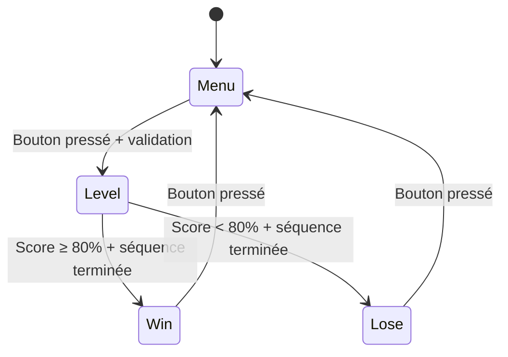

# TROMBOSS - Documentation Technique Complète

## Table des Matières
1. [Vue d'ensemble du projet](#vue-densemble-du-projet)
2. [Structure des dossiers et fichiers](#structure-des-dossiers-et-fichiers)
3. [Architecture logicielle](#architecture-logicielle)
4. [Variables et constantes](#variables-et-constantes)
5. [Fonctions principales](#fonctions-principales)
6. [Machine à états](#machine-à-états)
7. [Système de collisions](#système-de-collisions)
8. [Gestion audio](#gestion-audio)
9. [Optimisations et corrections](#optimisations-et-corrections)

---

## Vue d'ensemble du projet

**TROMBOSS** est un jeu musical interactif basé sur Arduino qui combine :
- **Affichage LED matriciel** (32x16) via contrôleur HT1632
- **Affichage 7-segments** pour score et niveau
- **Contrôles analogiques** (potentiomètre + bouton)
- **Audio** (buzzer pour feedback sonore)
- **Gameplay rythmique** avec 9 niveaux de difficulté

### Principe de jeu
- Des blocs musicaux défilent de droite à gauche
- Le joueur contrôle un curseur rouge sur les colonnes vertes (2-3)
- Objectif : toucher les blocs au bon moment pour marquer des points
- Score basé sur la précision des collisions

---

## Structure des dossiers et fichiers

```
TROMBOSS/
├── TROMBOSS.ino          # Programme principal
├── definitions.h         # Constantes, structures, variables globales
├── song_patterns.h       # Patterns musicaux pour tous les niveaux
├── ht1632.h             # Interface contrôleur LED
├── lib_magic.cpp        # Fonctions bas niveau pour affichage
├── notes_frequencies.h   # Correspondances notes/fréquences
├── coordmenu.txt        # Coordonnées menu (référence)
└── DOCUMENTATION.md     # Cette documentation
```

### Description des fichiers

| Fichier | Rôle | Contenu principal |
|---------|------|-------------------|
| `TROMBOSS.ino` | **Programme principal** | `setup()`, `loop()`, `periodicFunction()`, logique jeu |
| `definitions.h` | **Configuration** | Constantes, structures, variables globales |
| `song_patterns.h` | **Données musicales** | 9 niveaux × 4 parties (intro/verse/chorus/hook) |
| `ht1632.h` | **Interface hardware** | Contrôle matrice LED HT1632 |
| `lib_magic.cpp` | **Fonctions bas niveau** | Gestion pixels, 7-segments, shadow RAM |
| `notes_frequencies.h` | **Mapping audio** | Correspondances fréquences ↔ positions Y |

---

## Architecture logicielle

### Paradigme de programmation
- **Machine à états finis** (Menu → Niveau → Win/Lose)
- **Programmation orientée structure** (pas d'objets)
- **Interruption Timer** (25ms pour logique temps réel)
- **Optimisation mémoire** (utilisation PROGMEM pour données statiques)

### Flux d'exécution

```mermaid
graph TD
    A[setup()] --> B[Timer1 Interrupt 25ms]
    B --> C[periodicFunction()]
    C --> D[loop()]
    D --> E[État actuel]
    E --> F[Menu State]
    E --> G[Level State] 
    E --> H[Win State]
    E --> I[Lose State]
    F --> D
    G --> D
    H --> D
    I --> D
```

---

## Variables et constantes

### Constantes principales (definitions.h)

#### Matrice LED
| Constante | Valeur | Description |
|-----------|--------|-------------|
| `MATRIX_WIDTH` | 32 | Largeur matrice LED |
| `MATRIX_HEIGHT` | 16 | Hauteur matrice LED |
| `CURSOR_COLUMN_START` | 2 | Début zone curseur (colonnes vertes) |
| `CURSOR_WIDTH` | 2 | Largeur curseur (2 pixels) |
| `CURSOR_HEIGHT` | 2 | Hauteur curseur (2 pixels) |

#### Couleurs
| Constante | Valeur | Description |
|-----------|--------|-------------|
| `COLOR_OFF` | 0 | Pixel éteint |
| `GREEN_COLUMN_COLOR` | 1 | Vert (colonnes 2-3) |
| `CURSOR_COLOR` | 2 | Rouge (curseur) |
| `BLOCK_COLOR` | 2 | Rouge (blocs) |

#### États du jeu
| Constante | Valeur | Description |
|-----------|--------|-------------|
| `GAME_STATE_MENU` | 0 | Menu principal |
| `GAME_STATE_LEVEL` | 1 | Jeu en cours |
| `GAME_STATE_WIN` | 2 | Victoire |
| `GAME_STATE_LOSE` | 3 | Défaite |

#### Timing et difficulté
| Constante | Valeur | Description |
|-----------|--------|-------------|
| `TIMER_PERIOD` | 25000 | Période interruption (25ms) |
| `BLOCK_MOVE_CYCLES_LEVEL_1` | 50 | Cycles mouvement blocs niveau 1 (lent) |
| `BLOCK_MOVE_CYCLES_LEVEL_9` | 10 | Cycles mouvement blocs niveau 9 (rapide) |
| `NOTE_CREATION_CYCLES_LEVEL_1` | 60 | Cycles création notes niveau 1 (1.5s) |
| `NOTE_CREATION_CYCLES_LEVEL_9` | 12 | Cycles création notes niveau 9 (0.3s) |

### Structures de données

#### GameState
```cpp
typedef struct {
  uint8_t etat;           // État actuel (0-3)
  uint8_t level;          // Niveau de difficulté (1-9)
  uint32_t timeStart;     // Temps début niveau
  uint32_t timeElapsed;   // Temps écoulé
  bool gameOver;          // Flag fin de jeu
  bool pauseGame;         // Flag pause
} GameState;
```

#### Block (Bloc musical)
```cpp
typedef struct {
  int16_t x;              // Position X (peut être négative)
  int16_t oldX;           // Ancienne position X (pour effacement)
  uint8_t y;              // Position Y (0-14)
  uint8_t length;         // Longueur en pixels (1-8)
  uint8_t color;          // Couleur (2 = rouge)
  uint8_t active;         // 1 si actif, 0 sinon
  uint16_t frequency;     // Fréquence note associée
  uint8_t needsUpdate;    // Flag mise à jour affichage
  uint32_t hitPixels;     // Pixels touchés par curseur
} Block;
```

#### Cursor (Curseur joueur)
```cpp
typedef struct {
  uint8_t y;              // Position cible Y
  uint8_t yDisplayed;     // Position affichée Y
  uint8_t yLast;          // Dernière position (pour effacement)
  uint8_t state;          // Normal/Clignotant
  uint8_t visible;        // Visible/Caché
  uint8_t color;          // Couleur curseur
  uint16_t potValue;      // Valeur potentiomètre (0-1023)
  uint32_t lastBlinkTime; // Dernier clignotement
} Cursor;
```

#### Score
```cpp
typedef struct {
  uint16_t current;       // Score actuel joueur
  uint16_t maxPossible;   // Score maximum atteignable
  uint8_t transformed;    // Score en pourcentage (0-100)
} Score;
```

### Variables globales critiques

#### Protection contre corruption mémoire
```cpp
// Variable persistante protégée contre corruption shadowRAM
uint8_t persistentSelectedLevel = 1;

// Gestion états transitions
bool needButtonReset = false;
bool forceMenuReinit = false;
```

#### Système de timing
```cpp
// Cycles pour mouvement des blocs (varie selon niveau)
uint8_t blockMoveCycles = BLOCK_MOVE_CYCLES_LEVEL_6;

// Cycles pour création des notes (varie selon niveau)  
uint8_t noteCreationCycles = NOTE_CREATION_CYCLES_LEVEL_1;

// Compteur périodique global
volatile uint16_t periodicCounter = 0;
```

---

## Fonctions principales

### setup() - Initialisation système

```cpp
void setup() {
  // 1. Initialisation Serial (debug)
  Serial.begin(9600);
  
  // 2. Initialisation hardware
  Wire.begin();                    // Bus I2C
  ht1632_setup();                  // Matrice LED
  setup7Seg();                     // Afficheurs 7-segments
  pinMode(BUTTON_PIN, INPUT_PULLUP); // Bouton avec pull-up
  pinMode(BUZZER_PIN, OUTPUT);     // Buzzer
  
  // 3. Initialisation état jeu
  initGameState();                 // État initial = MENU
  initMenuState();                 // Configuration menu
  
  // 4. Initialisation curseur
  cursor.y = 0;
  cursor.yDisplayed = 0;
  cursor.state = CURSOR_STATE_NORMAL;
  cursor.visible = CURSOR_VISIBLE;
  cursor.color = CURSOR_COLOR;
  
  // 5. Initialisation blocs
  for (uint8_t i = 0; i < MAX_BLOCKS; i++) {
    blocks[i].active = 0;
    blocks[i].hitPixels = 0;
    blockNotePlaying[i] = false;
  }
  
  // 6. Configuration Timer1 (interruption 25ms)
  Timer1.initialize(TIMER_PERIOD);
  Timer1.attachInterrupt(periodicFunction);
}
```

**Rôle** : Configuration complète du système avant démarrage du jeu.

### loop() - Boucle principale

```cpp
void loop() {
  // 1. Mise à jour affichage 7-segments (optimisée)
  static unsigned long last7SegUpdate = 0;
  unsigned long currentTime = millis();
  unsigned long updateInterval = (gameState.etat == GAME_STATE_LEVEL) ? 200 : 500;
  
  if (currentTime - last7SegUpdate >= updateInterval) {
    // CORRECTION: Utilise variable persistante pour affichage fiable
    update7SegDisplay(gameState.etat, gameScore.transformed, persistentSelectedLevel);
    last7SegUpdate = currentTime;
  }
  
  // 2. Machine à états
  switch (gameState.etat) {
    case GAME_STATE_MENU:
      handleMenuState();
      break;
    case GAME_STATE_LEVEL:
      handleLevelState();
      break;
    case GAME_STATE_WIN:
      handleWinState();
      break;
    case GAME_STATE_LOSE:
      handleLoseState();
      break;
    default:
      changeGameState(GAME_STATE_MENU);
      break;
  }
}
```

**Caractéristiques** :
- **Non-bloquant** : Exécution continue
- **Optimisé I2C** : Mise à jour 7-segments espacée (200-500ms)
- **Machine à états** : Délégation selon état actuel
- **Gestion erreurs** : Retour automatique au menu si état invalide

### periodicFunction() - Interruption Timer (25ms)

Cette fonction est **cruciale** - elle gère toute la logique temps réel du jeu.

#### Structure générale
```cpp
void periodicFunction() {
  periodicCounter++;  // Incrément compteur global
  
  // === CONTRÔLES COMMUNS ===
  // Lecture bouton (tous les 10 cycles = 4 fois/seconde)
  // Lecture potentiomètre (tous les 4 cycles = 10 fois/seconde)
  
  // === MACHINE À ÉTATS SPÉCIFIQUE ===
  switch (gameState.etat) {
    case GAME_STATE_MENU: /* Sélection niveau */ break;
    case GAME_STATE_LEVEL: /* Logique jeu */ break;
    // Win/Lose : pas de traitement périodique
  }
}
```

#### Détail - Contrôles communs

**Gestion bouton (anti-rebond logiciel)**
```cpp
if (periodicCounter % 10 == 0) {  // 4 fois par seconde
  static bool lastButtonState = HIGH;
  bool buttonState = digitalRead(BUTTON_PIN);
  
  // CORRECTION: Réinitialisation après changement d'état
  if (needButtonReset) {
    lastButtonState = buttonState;
    needButtonReset = false;
    return; // Ignorer ce cycle
  }
  
  if (buttonState != lastButtonState) {
    if (buttonState == LOW) {  // Bouton pressé
      if (gameState.etat == GAME_STATE_MENU) {
        // Démarrer validation avec clignotement
        menuState.validationMode = true;
      } else if (gameState.etat == GAME_STATE_LEVEL) {
        // Activer clignotement curseur
        cursor.state = CURSOR_STATE_BLINKING;
      }
    } else {  // Bouton relâché
      if (gameState.etat == GAME_STATE_LEVEL) {
        cursor.state = CURSOR_STATE_NORMAL;
        shouldShowCursor = true;
      }
    }
    lastButtonState = buttonState;
  }
}
```

**Gestion potentiomètre**
```cpp
if (periodicCounter % 4 == 0) {  // 10 fois par seconde
  if (digitalRead(BUTTON_PIN) == HIGH) {  // Seulement si bouton relâché
    int newPotValue = analogRead(POT_PIN);
    
    // Filtrage anti-bruit (seuil 5)
    if (abs(newPotValue - cursor.potValue) > 5) {
      cursor.potValue = newPotValue;
      
      // Mapping 0-1023 → 0-14 (hauteur matrice - 2)
      int y = map(cursor.potValue, 0, 1024, 0, MATRIX_HEIGHT - 1);
      if (y < 0) y = 0;
      if (y > MATRIX_HEIGHT - 2) y = MATRIX_HEIGHT - 2;
      
      if (cursor.y != (uint8_t)y) {
        cursor.y = (uint8_t)y;
        displayNeedsUpdate = true;
      }
    }
  }
}
```

#### Détail - État MENU

**Sélection niveau via potentiomètre**
```cpp
if (periodicCounter % 10 == 0 && !menuState.validationMode) {
  int potValue = analogRead(POT_PIN);
  
  // Mapping INVERSÉ équitable 1024 → 9 niveaux
  uint8_t newLevel;
  if (potValue <= 113) newLevel = 9;      // 0-113 = niveau 9
  else if (potValue <= 227) newLevel = 8; // 114-227 = niveau 8
  else if (potValue <= 341) newLevel = 7; // 228-341 = niveau 7
  else if (potValue <= 455) newLevel = 6; // 342-455 = niveau 6
  else if (potValue <= 569) newLevel = 5; // 456-569 = niveau 5
  else if (potValue <= 683) newLevel = 4; // 570-683 = niveau 4
  else if (potValue <= 797) newLevel = 3; // 684-797 = niveau 3
  else if (potValue <= 911) newLevel = 2; // 798-911 = niveau 2
  else newLevel = 1;                      // 912-1023 = niveau 1
  
  if (newLevel != menuState.selectedLevel) {
    eraseMenuDigit(menuState.selectedLevel);  // Effacer ancien
    
    // CORRECTION: Triple synchronisation pour éviter corruption
    menuState.selectedLevel = newLevel;
    persistentSelectedLevel = newLevel;       // Variable protégée
    gameState.level = newLevel;
    
    drawMenuDigit(menuState.selectedLevel);   // Dessiner nouveau
  }
}
```

#### Détail - État LEVEL (le plus complexe)

**Clignotement curseur**
```cpp
if (periodicCounter % 8 == 0) {  // 5 fois par seconde
  if (cursor.state == CURSOR_STATE_BLINKING) {
    shouldShowCursor = !shouldShowCursor;  // Inverser visibilité
    displayNeedsUpdate = true;
    checkCursorCollision();  // Vérifier collisions pendant clignotement
  } else if (!shouldShowCursor) {
    shouldShowCursor = true;  // Assurer visibilité en mode normal
    displayNeedsUpdate = true;
  }
}
```

**Mouvement progressif curseur**
```cpp
// Déplacement du curseur (tous les cycles, mais progressif)
if (cursor.yDisplayed < cursor.y) {
  cursor.yDisplayed++;
  displayNeedsUpdate = true;
} else if (cursor.yDisplayed > cursor.y) {
  cursor.yDisplayed--;
  displayNeedsUpdate = true;
}
```

**Mouvement des blocs (timing variable selon niveau)**
```cpp
if (periodicCounter % blockMoveCycles == 0) {
  // 1. Déterminer bloc prioritaire pour audio
  int8_t blockToPlay = -1;
  int16_t minX = 1000;
  
  for (uint8_t i = 0; i < MAX_BLOCKS; i++) {
    if (blocks[i].active) {
      int16_t xStart = blocks[i].x;
      int16_t xEnd = xStart + blocks[i].length;
      
      // Bloc occupe-t-il colonnes vertes (x=2 ou x=3) ?
      if ((2 >= xStart && 2 < xEnd) || (3 >= xStart && 3 < xEnd)) {
        if (xStart < minX) {
          minX = xStart;
          blockToPlay = i;  // Bloc le plus à gauche prioritaire
        }
      }
    }
  }
  
  // 2. Marquer blocs pour audio
  for (uint8_t i = 0; i < MAX_BLOCKS; i++) {
    if (blocks[i].active) {
      bool onGreen = /* ... calcul position sur colonnes vertes ... */;
      blockNotePlaying[i] = (onGreen && i == blockToPlay);
    } else {
      blockNotePlaying[i] = false;
    }
  }
  
  // 3. Déplacer tous les blocs actifs
  for (uint8_t i = 0; i < MAX_BLOCKS; i++) {
    if (blocks[i].active) {
      blocks[i].oldX = blocks[i].x;  // Sauvegarder position
      blocks[i].x--;                 // Déplacer vers gauche
      
      // 4. Calcul score : +2 points quand colonne passe x=3
      int16_t oldEnd = blocks[i].oldX + blocks[i].length - 1;
      for (int16_t col = blocks[i].oldX; col <= oldEnd; col++) {
        int16_t newCol = col - 1;
        if (col == 4 && newCol == 3) {  // Passage x=4 → x=3
          addMaxScore(2);  // Ajouter 2 au score maximum
        }
      }
      
      // 5. Désactiver si complètement sorti
      if (blocks[i].x + blocks[i].length < -1) {
        blocks[i].active = 0;
        blockNotePlaying[i] = false;
      }
      
      blocks[i].needsUpdate = 1;
      displayNeedsUpdate = true;
    }
  }
}
```

**Création nouvelles notes (timing variable selon niveau)**
```cpp
if (periodicCounter % noteCreationCycles == 0) {
  if (!songFinished) {
    static bool noteCreationInProgress = false;
    
    if (!noteCreationInProgress) {
      noteCreationInProgress = true;
      nextNote();  // Créer prochaine note selon pattern musical
      noteCreationInProgress = false;
      displayNeedsUpdate = true;
    }
  }
  
  // Gestion fin de séquence (toutes les 2 secondes)
  if (songFinished && periodicCounter % 80 == 0) {
    bool allBlocksInactive = true;
    for (uint8_t i = 0; i < MAX_BLOCKS; i++) {
      if (blocks[i].active) {
        allBlocksInactive = false;
        break;
      }
    }
    
    if (allBlocksInactive) {
      // Réinitialiser séquence musicale
      songFinished = 0;
      currentSongPart = 0;
      songPosition = 0;
    }
  }
}
```

---

## Machine à États

### Transitions d'états



### handleMenuState()

**Responsabilités** :
- Initialisation affichage menu
- Gestion clignotement validation
- Transition vers niveau

**Initialisation** :
```cpp
if (!menuInitialized) {
  ht1632_clear();
  initMenuState();     // Récupération niveau persistant
  drawFullMenu();      // Affichage texte + boîte + chiffre
  menuInitialized = true;
}
```

**Validation** :
```cpp
void updateMenuValidation() {
  if (!menuState.validationMode) return;
  
  // Clignotement pendant 1 seconde
  if (currentTime - menuState.validationStart > 1000) {
    // CORRECTION: Utiliser variable persistante comme référence
    uint8_t levelToUse = (menuState.selectedLevel > 0 && menuState.selectedLevel <= 9) ? 
                         menuState.selectedLevel : persistentSelectedLevel;
    gameState.level = levelToUse;
    
    changeGameState(GAME_STATE_LEVEL);
    menuState.validationMode = false;
    return;
  }
  
  // Clignotement boîte/chiffre
  if (currentTime - menuState.lastBlinkTime > MENU_BOX_BLINK_INTERVAL) {
    menuState.boxVisible = !menuState.boxVisible;
    
    if (menuState.boxVisible) {
      drawMenuBox();
      drawMenuDigit(menuState.selectedLevel);
    } else {
      eraseMenuBox();
      eraseMenuDigit(menuState.selectedLevel);
    }
    
    menuState.lastBlinkTime = currentTime;
  }
}
```

### handleLevelState()

**Responsabilités** :
- Initialisation niveau de jeu
- Appel logique principale (`handleLevelLoop()`)
- Détection fin de niveau

**Protection contre corruption** :
```cpp
if (!levelInitialized) {
  // CORRECTION CRITIQUE: Vérifier niveau valide
  if (gameState.level == 0 || gameState.level > 9) {
    gameState.level = (persistentSelectedLevel > 0 && persistentSelectedLevel <= 9) ? 
                      persistentSelectedLevel : 1;
  }
  
  setDifficultyLevel(gameState.level);  // Configuration timing
  // ... initialisation complète
}
```

**Conditions de fin** :
```cpp
if (songFinished) {
  bool allBlocksInactive = true;
  for (uint8_t i = 0; i < MAX_BLOCKS; i++) {
    if (blocks[i].active) {
      allBlocksInactive = false;
      break;
    }
  }
  
  if (allBlocksInactive) {
    bool buttonPressed = digitalRead(BUTTON_PIN) == LOW;
    if (!buttonPressed) {  // Éviter skip automatique
      if (gameScore.transformed >= 80) {
        changeGameState(GAME_STATE_WIN);
      } else {
        changeGameState(GAME_STATE_LOSE);
      }
    }
  }
}
```

### handleWinState() / handleLoseState()

**Fonctionnement similaire** :
- Affichage écran victoire/défaite
- Attente interaction bouton
- Retour au menu avec nettoyage

---

## Système de collisions

### Principe

Le système détecte quand le curseur (2×2 pixels rouges) touche un bloc musical.

### checkCursorCollision()

```cpp
void checkCursorCollision() {
  for (uint8_t i = 0; i < MAX_BLOCKS; i++) {
    if (blocks[i].active) {
      uint32_t hitPixels = getBlockPixelsHitByCursor(i);
      
      if (hitPixels != blocks[i].hitPixels) {
        // Nouvelles collisions détectées
        uint32_t newHits = hitPixels & ~blocks[i].hitPixels;
        
        // Compter pixels nouvellement touchés
        uint8_t newHitCount = 0;
        for (uint8_t bit = 0; bit < 32; bit++) {
          if (newHits & (1UL << bit)) {
            newHitCount++;
          }
        }
        
        // Ajouter au score
        addScore(newHitCount);
        blocks[i].hitPixels = hitPixels;
      }
    }
  }
}
```

### getBlockPixelsHitByCursor()

**Calcul intersection curseur/bloc** :
```cpp
uint32_t getBlockPixelsHitByCursor(uint8_t blockIndex) {
  if (!blocks[blockIndex].active) return 0;
  
  uint32_t hitMask = 0;
  
  // Pour chaque pixel du bloc (longueur × 2 hauteur)
  for (uint8_t col = 0; col < blocks[blockIndex].length; col++) {
    for (uint8_t row = 0; row < 2; row++) {  // Hauteur bloc = 2
      int16_t blockX = blocks[blockIndex].x + col;
      uint8_t blockY = blocks[blockIndex].y + row;
      
      // Vérifier intersection avec curseur
      bool cursorOverlap = (blockX >= 2 && blockX <= 3) &&  // Colonnes curseur
                          (blockY >= cursor.yDisplayed && 
                           blockY < cursor.yDisplayed + 2);    // Lignes curseur
      
      if (cursorOverlap) {
        uint8_t pixelIndex = col * 2 + row;
        if (pixelIndex < 32) {  // Sécurité 32 bits
          hitMask |= (1UL << pixelIndex);
        }
      }
    }
  }
  
  return hitMask;
}
```

### Système de score

| Type | Calcul | Description |
|------|--------|-------------|
| **Score actuel** | `current` | Points marqués par collisions |
| **Score maximum** | `maxPossible` | Points totaux passés en x=3 |
| **Score transformé** | `(current * 100) / maxPossible` | Pourcentage (0-100%) |

**Conditions victoire/défaite** :
- **Victoire** : Score transformé ≥ 80%
- **Défaite** : Score transformé < 80%

---

## Gestion audio

### Principe

Un seul bloc peut jouer du son simultanément : le bloc **le plus à gauche** présent sur les colonnes vertes (x=2 ou x=3).

### Sélection bloc prioritaire

```cpp
// Dans periodicFunction() - mouvement des blocs
int8_t blockToPlay = -1;
int16_t minX = 1000;

for (uint8_t i = 0; i < MAX_BLOCKS; i++) {
  if (blocks[i].active) {
    int16_t xStart = blocks[i].x;
    int16_t xEnd = xStart + blocks[i].length;
    
    // Bloc occupe-t-il x=2 ou x=3 ?
    if ((2 >= xStart && 2 < xEnd) || (3 >= xStart && 3 < xEnd)) {
      if (xStart < minX) {
        minX = xStart;
        blockToPlay = i;  // Plus à gauche = prioritaire
      }
    }
  }
}

// Marquer blocs pour audio
for (uint8_t i = 0; i < MAX_BLOCKS; i++) {
  if (blocks[i].active) {
    bool onGreen = /* ... vérification position ... */;
    blockNotePlaying[i] = (onGreen && i == blockToPlay);
  } else {
    blockNotePlaying[i] = false;
  }
}
```

### updateAudio()

```cpp
void updateAudio() {
  #if MUSIQUE
  static uint16_t lastFrequency = 0;
  uint16_t currentFrequency = 0;
  bool anyBlockPlaying = false;
  
  // Trouver fréquence du bloc prioritaire
  for (uint8_t i = 0; i < MAX_BLOCKS; i++) {
    if (blockNotePlaying[i]) {
      currentFrequency = blocks[i].frequency;
      anyBlockPlaying = true;
      break;  // Un seul bloc peut jouer
    }
  }
  
  // Mettre à jour buzzer si changement
  if (anyBlockPlaying) {
    if (currentFrequency != lastFrequency) {
      tone(BUZZER_PIN, currentFrequency);
      lastFrequency = currentFrequency;
    }
  } else {
    if (lastFrequency != 0) {
      noTone(BUZZER_PIN);
      lastFrequency = 0;
    }
  }
  #endif
}
```

---

## Optimisations et corrections

### Problème shadowRAM corruption

**Symptôme** : Niveau sélectionné (L:6) ne correspond pas au niveau joué (NIV 0).

**Cause** : La variable `gameState.level` était corrompue par des problèmes de mémoire shadowRAM lors des transitions d'état.

**Solution** : Variable persistante protégée
```cpp
// Variable protégée contre corruption
uint8_t persistentSelectedLevel = 1;

// Triple synchronisation lors de sélection
menuState.selectedLevel = newLevel;
persistentSelectedLevel = newLevel;  // PROTECTION
gameState.level = newLevel;

// Restauration automatique en cas de corruption
if (gameState.level == 0 || gameState.level > 9) {
  gameState.level = (persistentSelectedLevel > 0 && persistentSelectedLevel <= 9) ? 
                    persistentSelectedLevel : 1;
}

// Affichage 7-segments utilise variable protégée
update7SegDisplay(gameState.etat, gameScore.transformed, persistentSelectedLevel);
```

### Nettoyage shadowRAM

**Problème** : Artefacts visuels lors changements d'état.

**Solution** : Triple nettoyage
```cpp
void changeGameState(uint8_t newState) {
  // Triple nettoyage matrice LED
  ht1632_clear();
  delay(10);
  ht1632_clear();
  delay(10);
  ht1632_clear();
  
  // Nettoyage manuel shadowRAM
  for (int chip = 0; chip < 4; chip++) {
    for (int addr = 0; addr < 64; addr++) {
      ht1632_shadowram[addr][chip] = 0;
    }
  }
  
  // Réinitialisation flags optimisation
  last7SegGameState = 255;
  last7SegScore = 255;
  last7SegLevel = 255;
}
```

### Optimisation affichage 7-segments

**Problème** : Blocages I2C dans interruption.

**Solution** : Déplacement vers loop() avec limitation fréquence
```cpp
// Dans loop() - pas dans interruption
if (currentTime - last7SegUpdate >= updateInterval) {
  update7SegDisplay(gameState.etat, gameScore.transformed, persistentSelectedLevel);
  last7SegUpdate = currentTime;
}

// Mise à jour seulement si changement
void update7SegDisplay(uint8_t gameState, uint8_t transformedScore, uint8_t level) {
  if (transformedScore != last7SegScore) {
    displayScore(transformedScore);
    last7SegScore = transformedScore;
  }
  if (level != last7SegLevel) {
    displayLevel(level);
    last7SegLevel = level;
  }
}
```

### Timing variable par niveau

**Innovation** : Deux systèmes de timing indépendants

| Niveau | Mouvement blocs | Création notes | Difficulté |
|--------|----------------|----------------|------------|
| 1 | 50 cycles (1.25s) | 60 cycles (1.5s) | Très facile |
| 2 | 45 cycles (1.125s) | 50 cycles (1.25s) | Facile |
| 3 | 40 cycles (1.0s) | 42 cycles (1.05s) | Modéré |
| 4 | 35 cycles (0.875s) | 35 cycles (0.875s) | Moyen |
| 5 | 30 cycles (0.75s) | 30 cycles (0.75s) | Difficile |
| 6 | 25 cycles (0.625s) | 25 cycles (0.625s) | Très difficile |
| 7 | 20 cycles (0.5s) | 20 cycles (0.5s) | Expert |
| 8 | 15 cycles (0.375s) | 15 cycles (0.375s) | Maître |
| 9 | 10 cycles (0.25s) | 12 cycles (0.3s) | Impossible |

### Patterns musicaux améliorés

**Avant** : Durées uniformes par niveau (ennuyeux)
**Après** : Patterns rythmiques variés

```cpp
// Exemple niveau 4 - Mix de durées pour créer du rythme
const MusicNote level4_intro[] PROGMEM = {
  {523, 12}, {587, 10}, {659, 8},   // Accélération
  {698, 6},  {784, 12}, {880, 10},  // Rythme complexe
  {988, 8},  {1047, 6}              // Finale rapide
};
```

---

## Conclusion

TROMBOSS est un projet complexe combinant :
- **Gestion temps réel** avec interruptions Timer
- **Machine à états robuste** avec protection contre corruption
- **Optimisations mémoire** (PROGMEM, shadowRAM)
- **Interface utilisateur** intuitive (potentiomètre + bouton)
- **Gameplay musical** avec 9 niveaux progressifs

Le code est structuré pour être **maintenable**, **extensible** et **robuste** face aux contraintes hardware Arduino.
